## Goal

The goal for this sprint is a part of a major goal, which is redesigning a V2 bot. This sprint focuses on redesigning the chassis to a more space efficient version, while retaining the suspension design that we learned from S3R5 team. A secondary target of this sprint is to ensure the cabling of the motor wires are done correctly, to avoid any unnecessary tension on the connectors. Key indicators to the success of my goal:

- There is sufficient space for wiring in upper layers
- Optimal first layer space utilization (enough space to place a dropper)
- Ground clearance (more than 2cm, the largest obstacle size)
- Cables have adequate routes and avoid tension

#### Problem:

The current chassis has the motors mounted *above* the base layer, which results in space inefficiency. Less space is able to be used for the mounting of the MUX and the stepper motor, which results in cabling difficulties. Additionally, the battery was meant to go in the space in the center, but is blocked by cables.

Another major issue is the disorganized cabling of our previous robots. In the design process of these previous iterations, cabling strategies were ignored while designing the robot. This needs to be fixed for our newer version, making strategic cabling decisions to avoid clutter. 

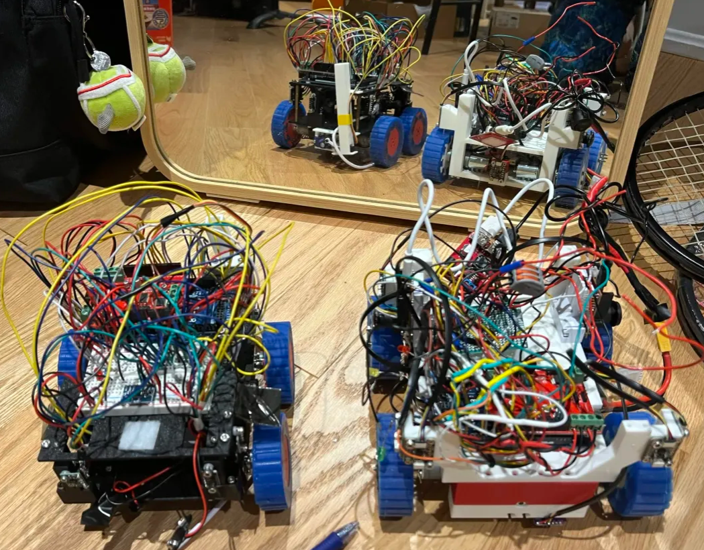

## Research:

**Suspension reference**

At RoboCup Americas 2025, we met S3RS team. They had a suspension mechanism where their suspension shaft was suspended by two panels, with a dead axle shaft in between. Their design was simple yet effective, with the only necessary parts to support the suspension being 2 bearings, and a shaft. 

<table width="100%">
  <tr>
    <td width="50%" align="center">
      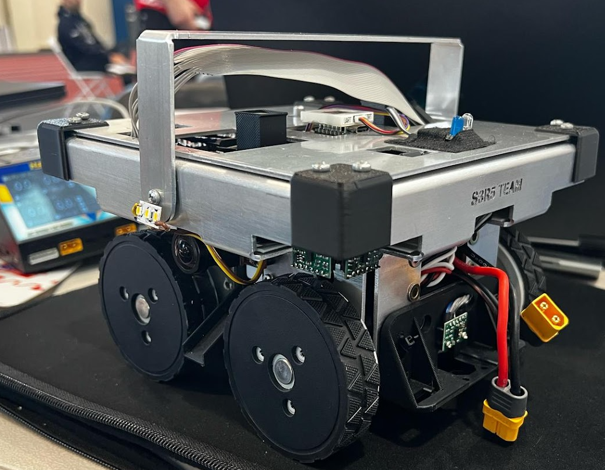
    </td>
    <td width="50%" align="center">
      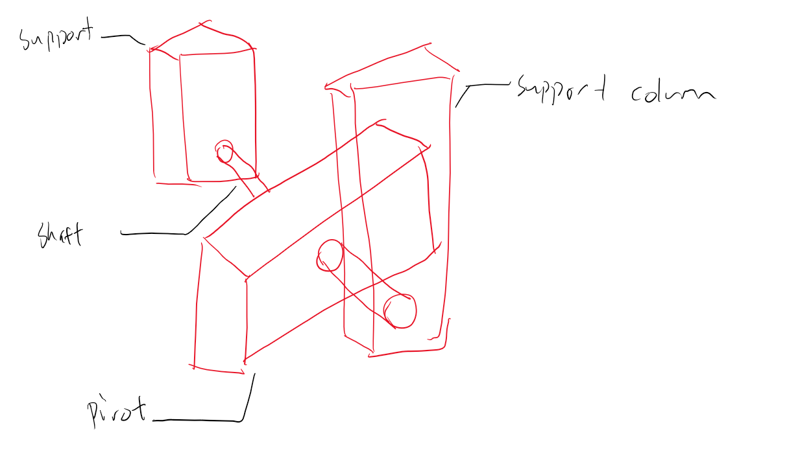
    </td>
  </tr>
  <tr>
    <td align="center"><h5>S3R5 Team Robot</h5></td>
    <td align="center"><h5>S3R5 Team design illustration</h5></td>
  </tr>
</table>

**Dead Axle**

While researching the best way to mount the suspension, I considered a strategy that I've seen widely used in robotics competitions, such as FRC and FTC. The mechanism is a dead axle. In a dead axle, there is a fixed axle that doesn't rotate, while the rotating object is mounted with bearings, freely moving on the axle. There were many key advantages to this, but the most important factor was that a dead axle prevents **Torsional Stress** from a rotating axle. In my application, this is ideal, since I wanted to created a strong shaft that wouldn't break under constant use.

<table width="100%">
  <tr>
    <td width="50%" align="center">
      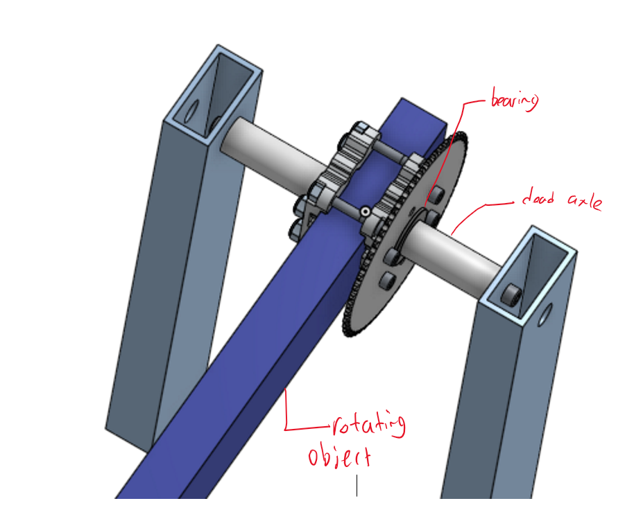
    </td>
    <td width="50%" align="center">
      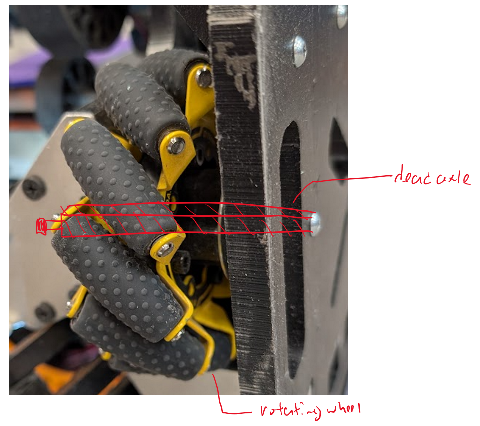
    </td>
  </tr>
  <tr>
    <td align="center"><h5>FRC Dead Axle</h5></td>
    <td align="center"><h5>FTC Dead Axle</h5></td>
  </tr>
</table>

Both of the examples above showcase the strength of dead axles. They are a component that I'm familiar with using, with a perfect fit to my application. 

**Strain Relief**

While looking through techniques on relieving cable strain, I came across a design on Wikipedia. Strain relief was provided to the cable by having it turn a corner. We implemented a similar design onto our robot, with "posts" for the cables to string around. This design prevents any pulling on key connections. 

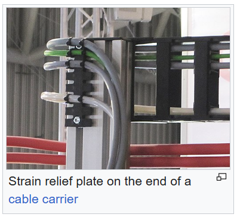

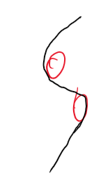
<h5 align="center">Cable strain relief design</h5>

## Ideation:

**Chassis structure**

Design the chassis in such a way where the motors go *under* the bottom layer, leaving more space for mux, cabling, and the battery.

- In this chassis design motors will be mounted underneath
- This creates a space between first and second layer, which is perfect for mounting a dropper

**Suspension Constraint Structure**

Reformat the position of the suspension constraint wedge to save space underneath the robot. If this isn't done, the changes to the motor positions are pointless. 

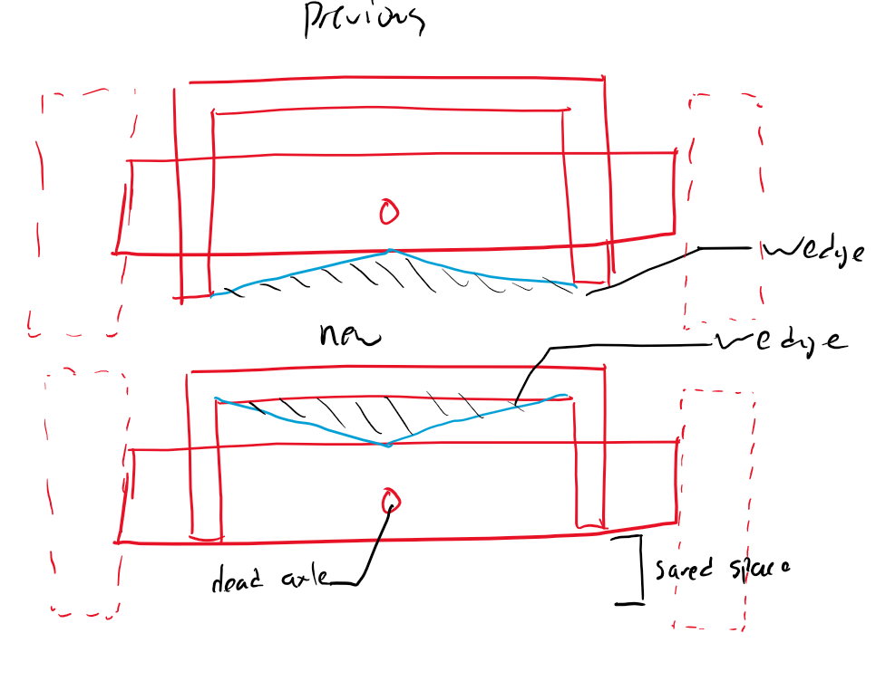

- There is significant space saved from moving the wedge to the top
- Wheels can decrease their diameter, shrinking the sizing of the robot. 

**Strain Relief**

The goal of this is to make a post that is structurally rigid, and gives adequate space for all cables to fit through. 

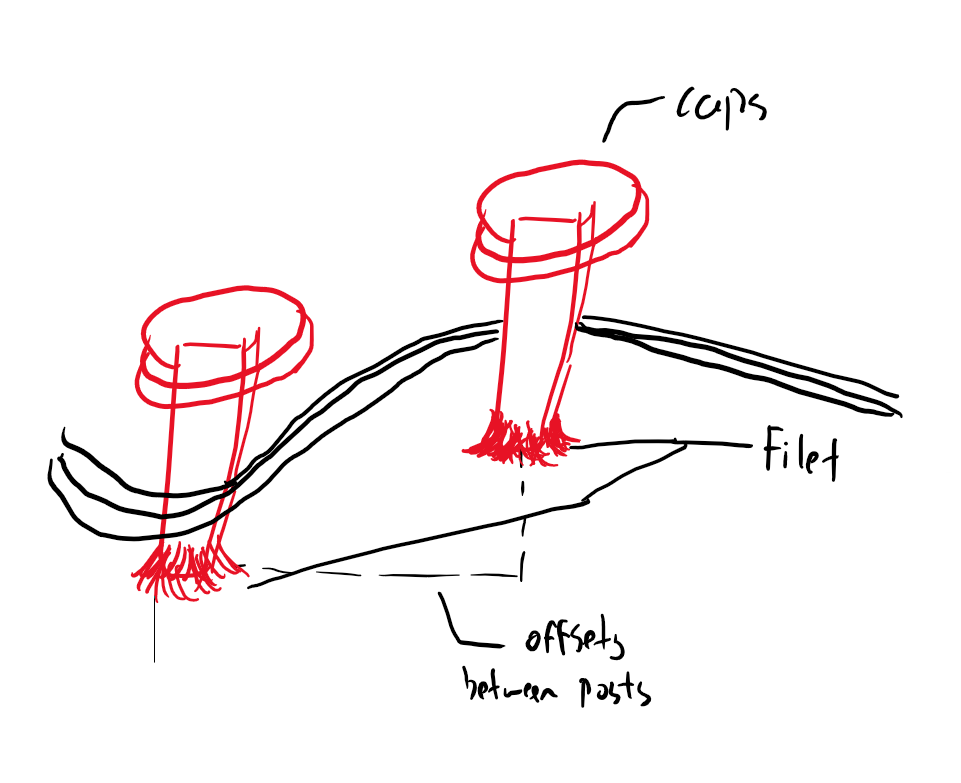

- Caps are added to posts to prevent cables from slipping out
- Offsets are created, so no extra strain is created on cables, only relief
- Filets on bottom of posts to improve structural rigidity

# Daily Documentation

This section will include more reflection on my design choices, and how I adapted the design through testing (in cad, needed to resize dimensions the more I designed). 

## 2026/01/16

Today's Goal: 

- Plan out the ideas for the spring, they are shown above!
- Start the framework to figure out dimensions for the new chassis. Dimensions include:
  - Wheel size
  - Ground clearance
  - Length
  - Width

#### Chassis Side Profile:

- 2cm of ground clearance after motors are mounted
- 18cm chassis length
- 7cm wheel diameter

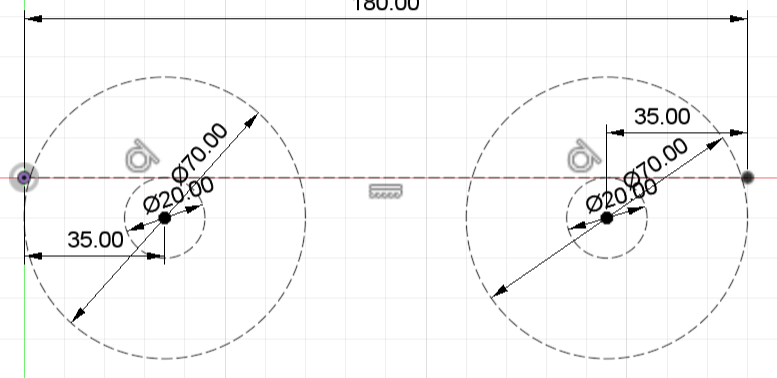

#### Suspension Front Profile:

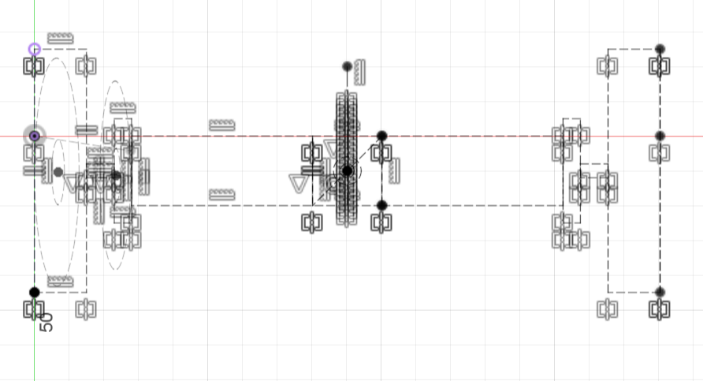

## 2026/01/20

#### Today's Goal:

- Create chassis base
  - Space for battery mount
  - Adjust chassis sizing

#### Full Chassis:

- Battery mount packaged to fit under the base layer to give more space
- Wheels resized to 80cm to give 2cm of ground clearance
- Chassis lengthened to 195cm to fit battery

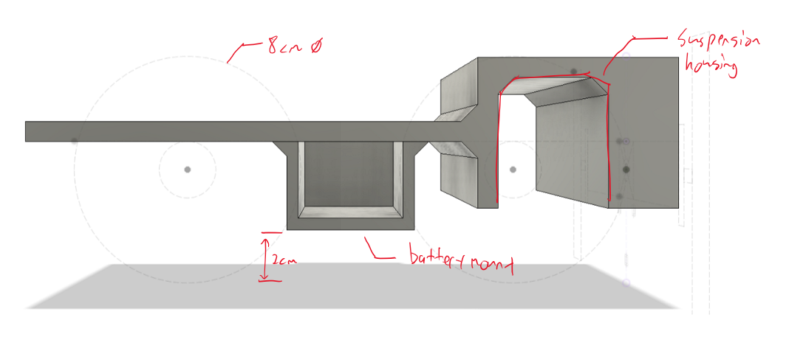

## 2026/01/21

#### **Today's Goal**: 

- Create suspension axle
  - Suspension axle should have the motor mounts built in
- Create integrated motor mounts for back wheels
- Cabling
  - Use friction posts to provide relief for connections

#### **Suspension axle**:

- Added press fit for bearing. The measurement for this is the exact diameter of the bearing, with 1mm of clearance for depth. (this press fit has been tested on a previous design, and works phenomenally)
- Integrated motor mount saves space

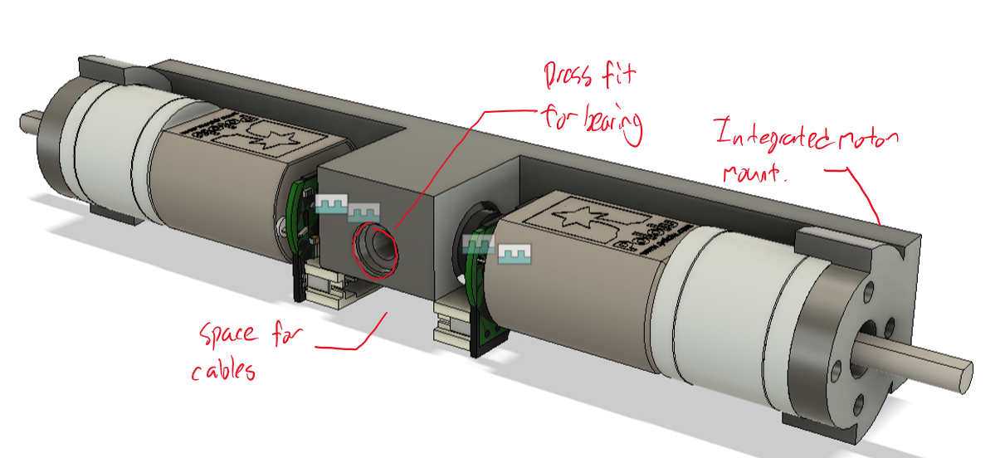

#### Back wheel:

- Works as it needs to do

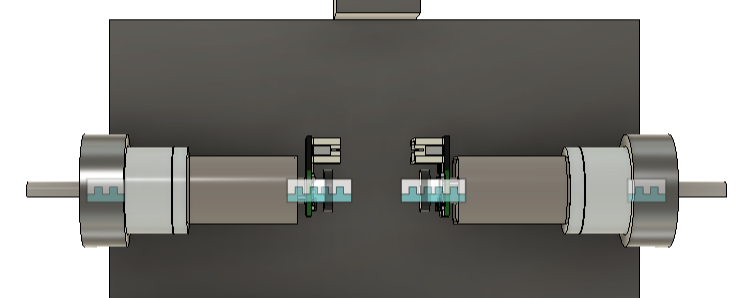

#### Cabling:

- Cabling channel for suspension, directly under mounting point for ease of access
- 2 holes made for zip tie mounts, to secure cables
- 1mm countersink to make placing 2mm washers easier
- Strain relief posts to prevent any pulling on motor connection

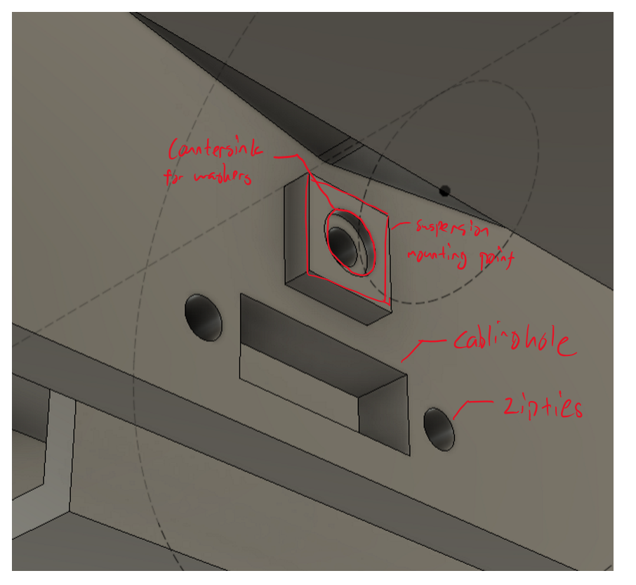

<table width="100%">
  <tr>
    <td width="50%" align="center">
      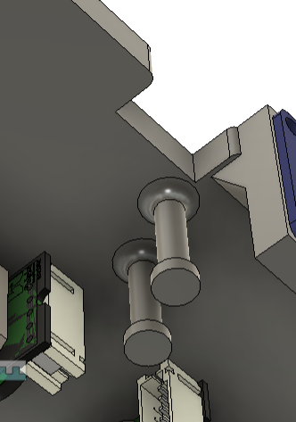
    </td>
    <td width="50%" align="center">
      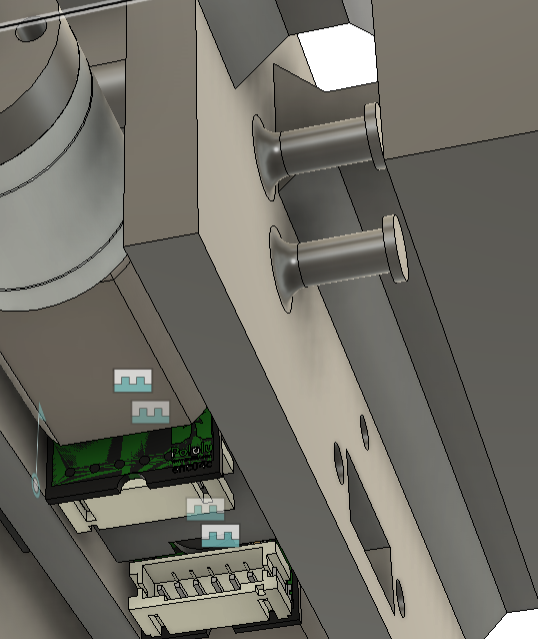
    </td>
  </tr>
  <tr>
    <td align="center"><h5>Cabling guides for back motors</h5></td>
    <td align="center"><h5>Cabling guides for front motors</h5></td>
  </tr>
</table>

## Finished Design/Critique

The suspension reformatted chassis and suspension wedge was very successful. There is lots of space beneath the chassis, to provide ground clearance of obstacles. The repositioning of the wedge makes it fit seamlessly with the whole design.

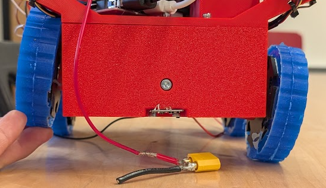

The strain relief posts did exactly what they were needed to do. As you can see, the lengths that I have set here were correct, and there is no further strain on the motor. However, the posts are a little bit short. This wasn't considered when I was designing the part, so the quantity of cables passing through will be noted for future designs.

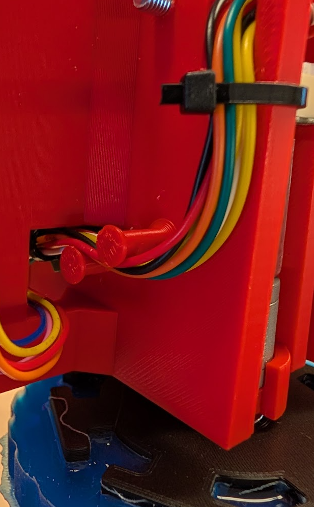

# Conclusion

This design was very successful. Now that the space at the bottom layer has been cleared, there is enough room to create a design for a dropper on the bottom layer. This will lead to significant space saving, aiding us in our ability to make our robot more compact and modular.

The cabling has been significantly improved, with minimal strain on the motors. Future design choices should also consider the amount of cables traveling through, scaling the size of the post from that. 

**Next Steps**:

- Create a dropper design to fit with this current design 
- Add second layer, with cabling features. 
- Create distance sensor mounts
- Design wheel casting molds.
