# Sprint 2

## Goal

The goal for this sprint is to create a cube dropper can fit into the space between my bottom layer and my second layer. This will properly utilize our space, giving us more room for cabling and other key items on the second and top layer. Additionally, the design needs to funnel the cubes into the 15cm square, with chutes that don't block the camera. The key points to determine the success of this goal are:

- Dropper fits within the small space between the first and second layer
- Dropper can index effectively (drop packets in the correct order)
- Dropper puts cubes within the 15cm radius that the packets need to be in. 

## Research

**Pez Dispenser**

[Google Patents Link](https://patentimages.storage.googleapis.com/fd/19/9d/2968bb013a5a3a/US2620061-drawings-page-1.png)

A PEZ dispenser is a mechanism used to dispense little tablets of mints, later turned into candy dispensers, seen on candies.

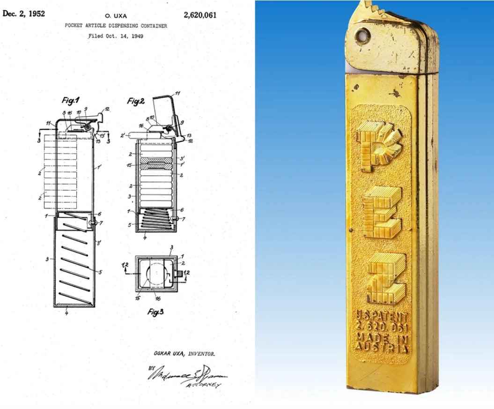

This design is extremely simple. It uses a spring to push the tablets into position, then a kicker to eject them. This cycle allows for one by one ejection of tablets. 

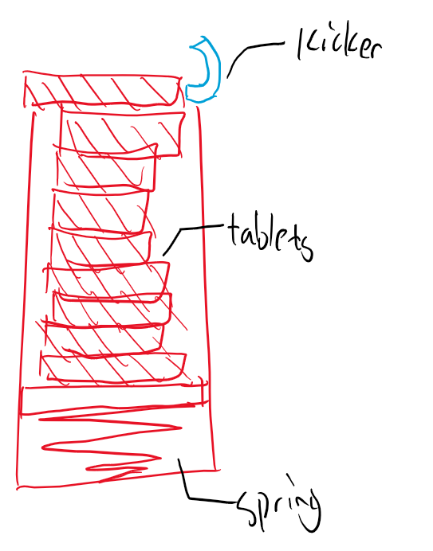

**Turntable-Style Dropper**

[Gumball Mechanism Explanation (Youtube)](https://www.youtube.com/watch?v=Q3ZeUNDg4fQ)

One unique mechanism found in a gumball machine is a turntable style dispenser. A turntable with cutouts to fit gumballs is mounted on a rotating axle. The gumball fits well into the cutout, and is rotated by the turntable, until it reaches a dispensing gap, causing the ball to fall through. Because of the wide presence of gumball machines, this design has proven its reliability. 

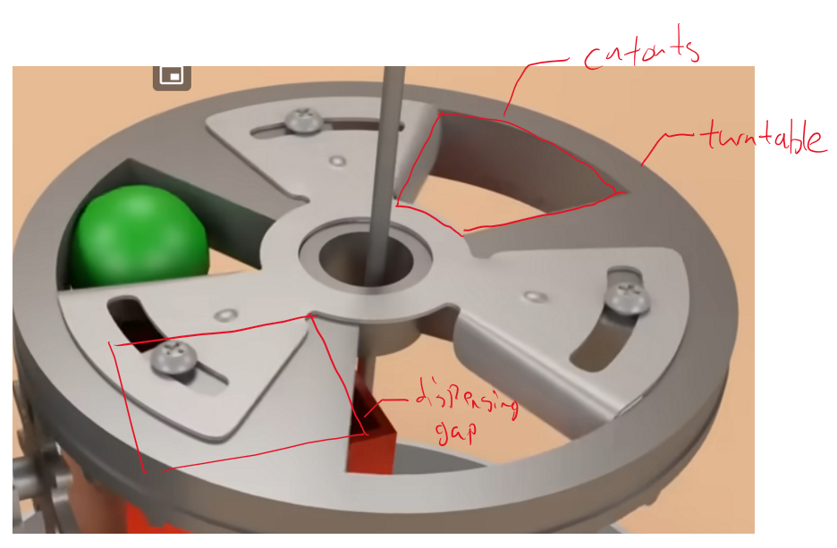

At RoboCup Americas 2025, the best performing robot had a very similar design, with a turntable containing square cutouts for cubes. This showed our team that this design style was feasible for small RoboCup maze robots. 

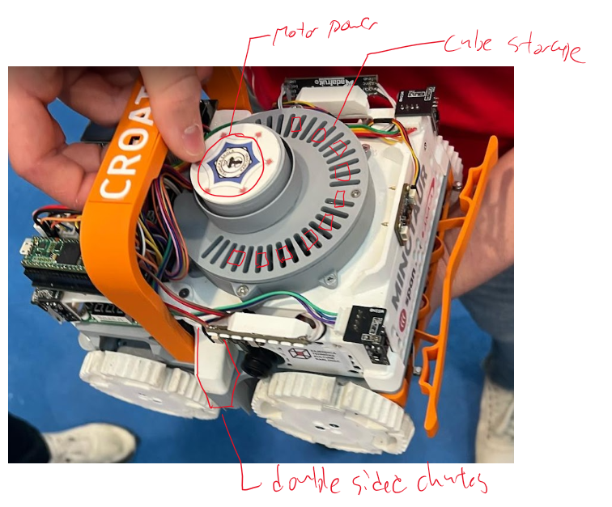

This design was very strong in many ways, including:

- Turntable design allowed us to drop cubes on both sides
- Very compact packaging, fits nicely onto one layer
- Simple to load

**Paddle Dispenser**

[Patent Application](https://www.patentsencyclopedia.com/app/20140183217)

This paddle mechanism stacks the cans it's dispensing. It uses gravity to let these cans flow downwards, towards a paddle, which dispenses one can at a time. This simple mechanism is very robust. 

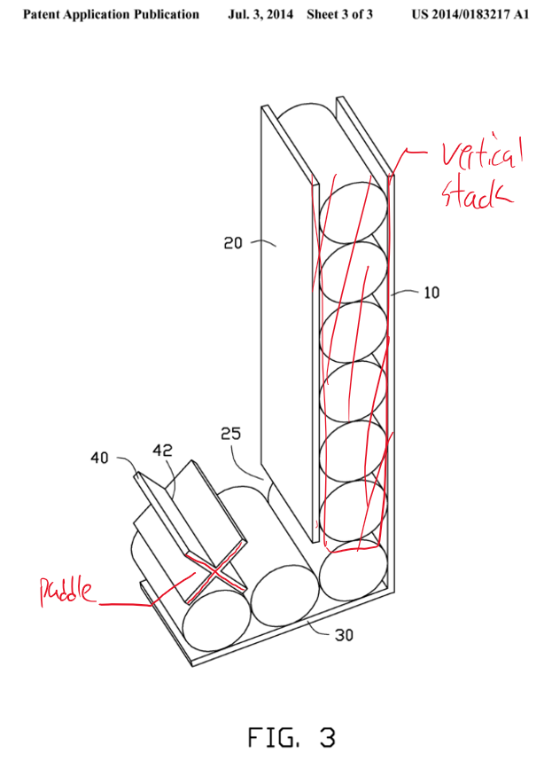

## Ideation

**Turntable Dropper**

This design uses the turntable mechanism. It is a very simple mechanism, with a stepper motor turning a large table with cubes on the outer edges. There are two holes, and two chutes, which allow for the selection of which side to drop. The chutes help funnel the cubes towards the 15cm radius of the rescue packet zone. 

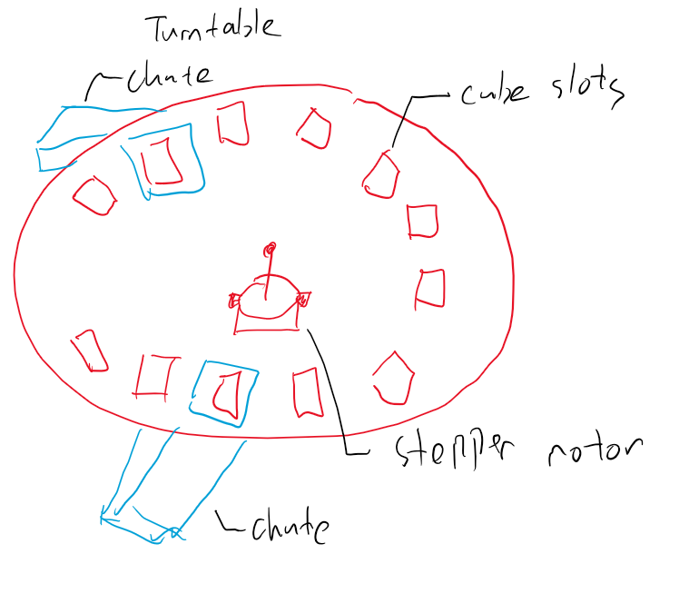

Pros:

- Simple and robust design
- Side selection
- Flat (can fit nicely onto a layer)

Cons:

- Takes a large amount of surface on a layer
- Takes longer to load

**Paddle Dispenser**

The paddle dispenser places cubes in a stack, using gravity to funnel them towards a paddle area. The paddle ensures that only one cube exits at a time. It acts as a pushing mechanism, ejecting the cube towards the 15cm zone. 

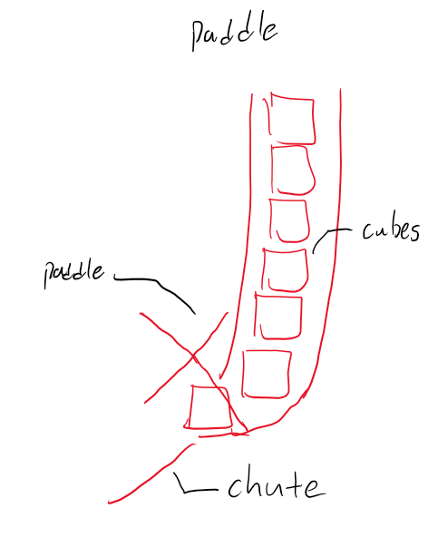

Pros:

- Simple to load
- Takes up less space on one layer, instead, just vertical space

Cons:

- Placement of actuator for paddle is difficult
- Geometry of paddle is difficult to design around
- No side selection

**Inverted Pez Dispenser**

This design also uses a stack mechanism to hold all the cubes. A pusher ejects one cube at a time, allowing another cube to flow in after the pusher exits the area. 

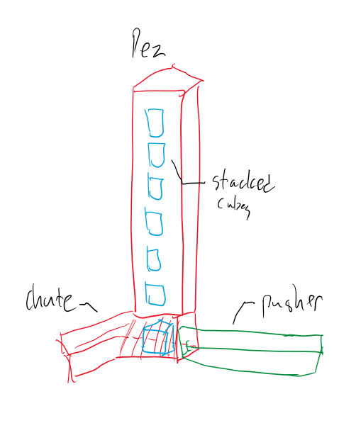

Pros:

- Simple to load
- robust design, unlikely to malfunction

Cons:

- Pusher takes up a lot of space
- No side selection

**Final Chosen Idea**

The final chosen idea is a turntable style dropper. This design provides one necessary component that the others don't, which is the side selection of where to drop the cubes. This saves time, because the robot does not need to spin 180 degrees to eject a cube in the right location. 

Additionally, the packaging of this dropper will fit nicely into the space between my two layers, with space in the bottom for the motor. There will be large openings for cubes to drop through, and chutes to funnel them close to the wall.

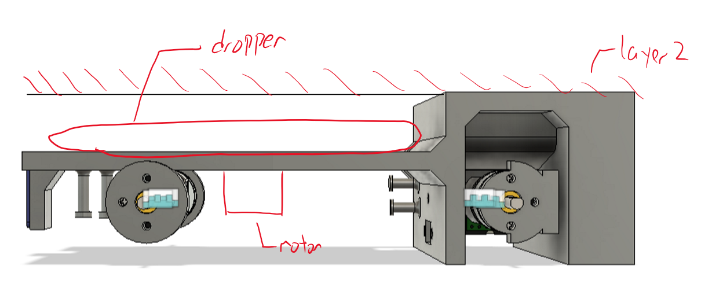

An extra design addition to help improve the consistency of this mechanism are guide rails. There is no lateral movement constraint on the turntable except for the motor. The guide rails take away the forces that could potentially damage the motor, helping to ensure the longevity of this design. 

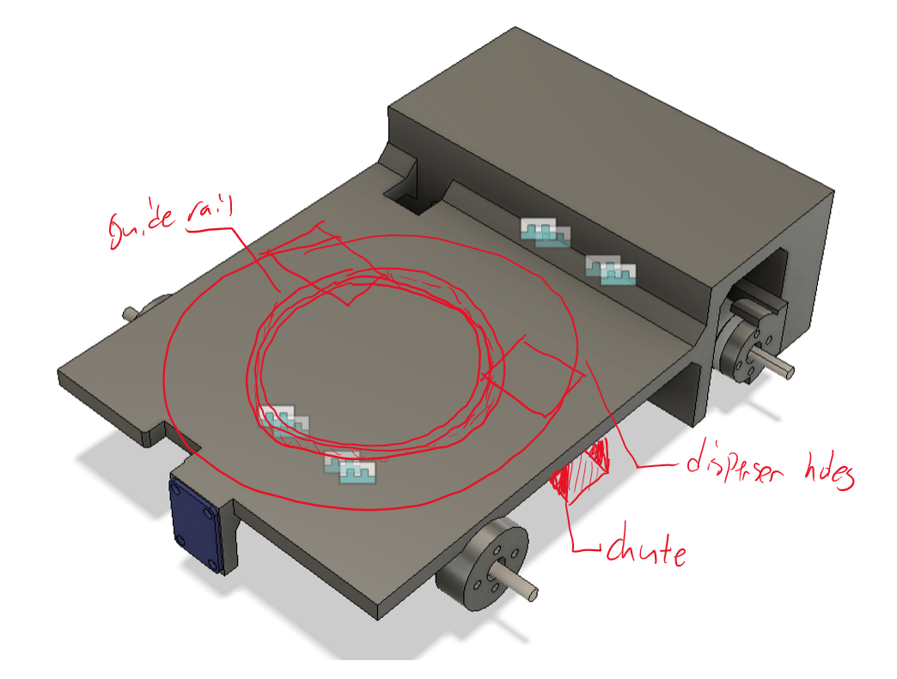

## Prototypes, Testing & Critique

Our previous robot used the same design, and there were many things that we learned from the use of this design. These lessons will help us prevent future mistakes from happening with our next design. 

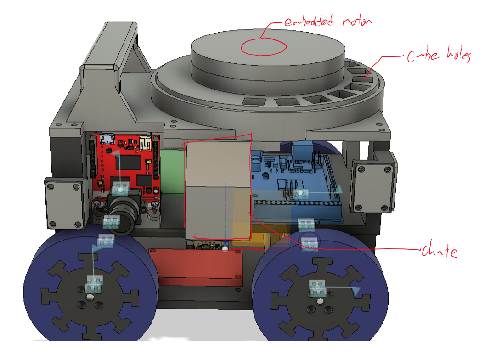

Firstly, this design took up a large amount of space, because of the positioning of the motor. Since the motor was embedded within the dropper, there needed to be a large amount of excess material and space dedicated towards its fitting. 

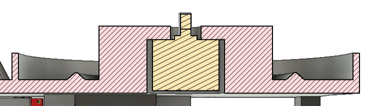

Another major issue with this design was the engagements of the guide. When designing, no space was left between the dropper and the top layer of the base. This meant that the dropper was slightly elevated over where the guide was supposed to be, preventing it from engaging. 

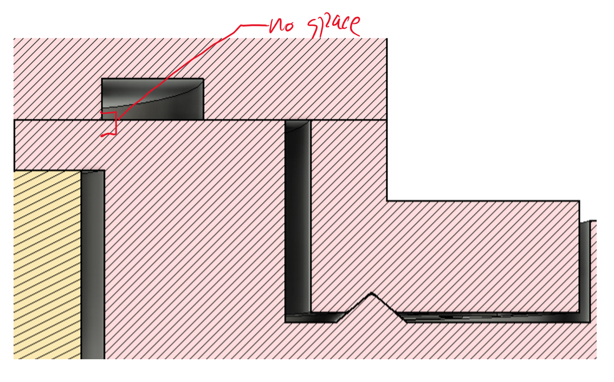

The height of the chutes also posed a major problem in this design. When dropping from such a high height, there was a potential for the cubes to bounce, and roll away from where they were intended to drop. 

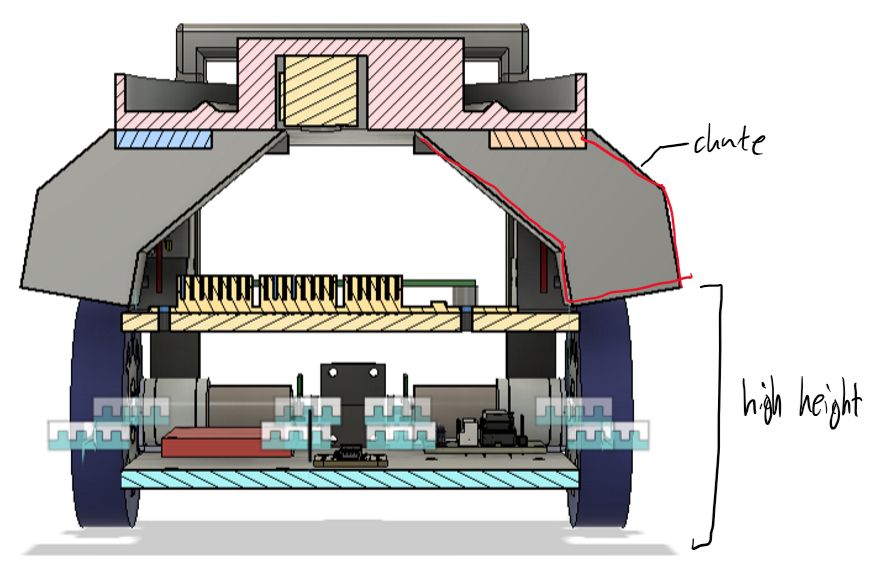

**Next Steps:**

The first decision is to place the motor beneath where the dropper is. This saves a lot of excess space, and fits perfectly with my chassis design. 

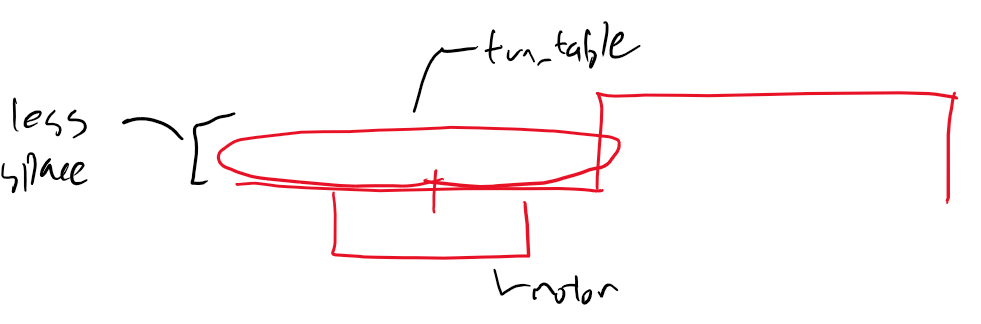

Secondly, there will be some clearance between the top layer, and the guide. This will allow for full engagement of the guides, without any other contact interfering . 

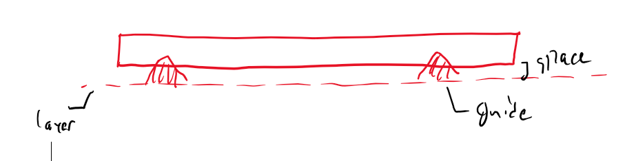

Thirdly, the dropper will be placed at a lower height, to prevent the cubes from accidentally rolling during the dropping phase. 

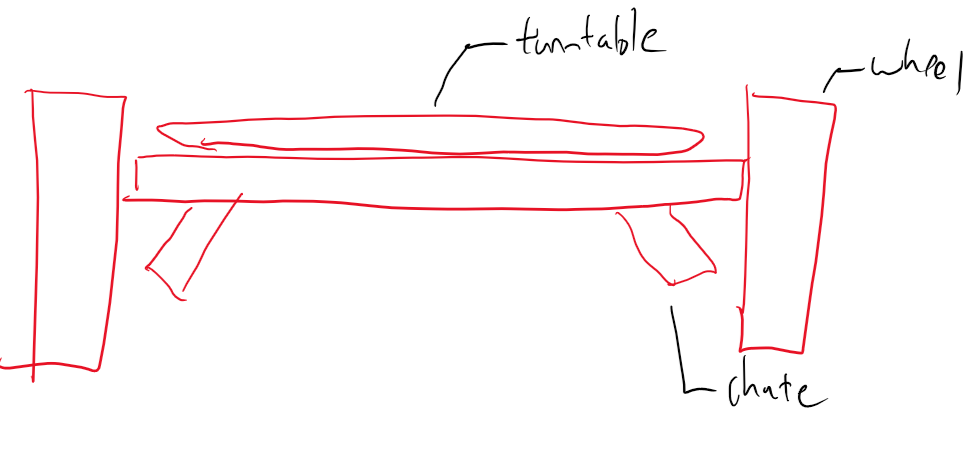

## Final Design

The final concept is extremely compact, and space efficient. Key aspects to note about this design are:

- 19mm x 19mm hole for 10mm x 10mm cubes to fall through
  - Allows a larger space for cubes to rotate around, to prevent any jamming
- Two chutes
  - **Allows for indexing of which side to drop out, to prevent full robot rotations, saving time.** 

- 1mm clearance between dropper and ground
  - Prevents craping on any countersunk screws, and gives tolerance to work with
- 8mm x 4mm triangular spikes
  - Allow for an extremely large contact surface with the dropper
  - Creates the stability needed to prevent lateral movement
- Stepper motor mounted on the bottom, with press fit shaft
  - **Mounting the stepper motor on the bottom saved lots of space, allowing for a completely empty 2nd layer to place wiring and other components**
  - Press fit is the simplest method to connect these surfaces, saving the space that a motor mount would've taken
- Steep chute angle to align with wheel position
  - **Allows the cubes to be dropped outside where the wheels are positioned, staying in the 15cm circle that rescue packets need to be in**

# Conclusion

This design is very effective, and built on our past experiences from other dropper style designs. It fits in an extremely compact format between two layers, allowing for full development on the second layer. However, due to rule changes, the maximum amount of cubes has been changed to 8. This gives access to a wide variety of previously unusable designs. In future sprints, I will investigate different mechanisms to see if there is any more efficient way of packaging the dropper. 