# Sprint 3

## Goal

The goal for this sprint is to create a rescue packet that is weighted, helping it stay within the 15cm radius where the points are evaluated. Key indicators for success are:

- Fits in a 10x10x10mm package

- Can be 3d-printed, or simple to assemble
- Stay within 15cm radius when dropped

## Research

**Loaded Dice**

[Youtube Short](https://www.youtube.com/shorts/_t8j6g0dd9Y)
[TrickDice.com](https://trick-dice.com/product/double-trouble-face-loaded/)

A loaded dice places an extra weight on one face of the dice, incentivizing this roll more. The youtuber Engineering Addiction ran tests with this dice, finding that the loaded dice had a 41% chance of landing on the weighted side, significantly higher than normal 16.67%. The hidden weight used in this design is an iron insert, which is a relatively dense metal, at 7.874 g/cm³ (NIST). 

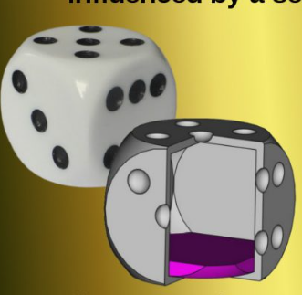

**Roly Poly Toy**

[Youtube](https://www.youtube.com/watch?v=QMjszY40BoU&t=17s)
[Computer Aided Geometric Design](https://doi.org/10.1016/j.cagd.2016.02.001)

A roly-poly toy is a self righting doll, which can return to an upright position no matter how you move it. There is a hollow cavity with a weight inside, which is used to correct the cube back into equilibrium. The weighted ball and the size of the cavity are tuned to ensure the ball can reach properly. The wobbling of the toy helps dissipate energy given into the system, which keeps the toy in place. 

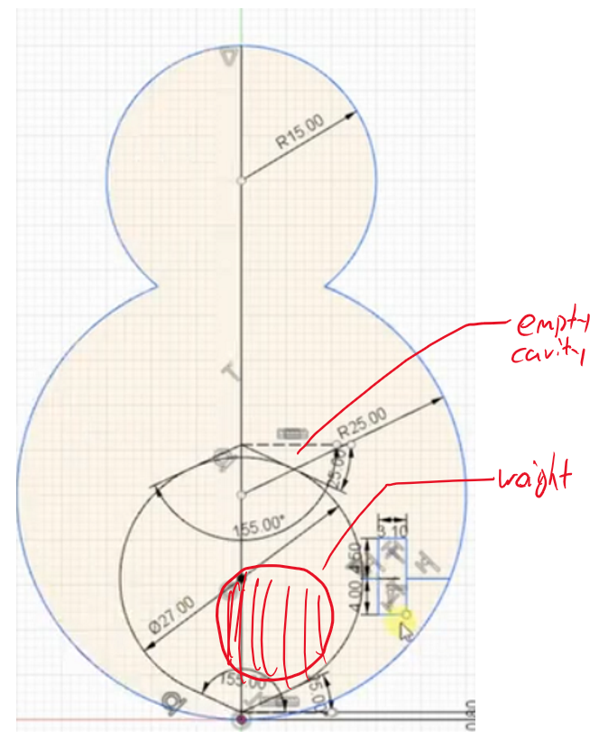 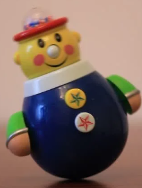

**Viscoelastic Material**

[Science Direct](https://www.sciencedirect.com/topics/materials-science/viscoelastic-material?utm_source=chatgpt.com)
[Sorbothane Inc.](https://www.sorbothane.com/technical-data/articles/what-is-viscoelastic-material/)

A viscoelastic material exhibits both elastic and viscous properties. They begin by absorbing forces like an elastic, then dissipate them like a viscous Newtonian fluid. These properties allow for the object to receive impact, and spread it out. Common examples are cornstarch and water, or silicon. 

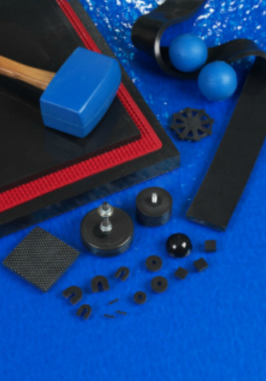

**Cube Physics**

[Chaos: An Interdisciplinary Journal of Nonlinear Science](https://www.researchgate.net/profile/Marcin-Kapitaniak/publication/234029725_The_three-dimensional_dynamics_of_the_die_throw/links/00b49528f8de4c42cb000000/The-three-dimensional-dynamics-of-the-die-throw.pdf?utm_source=chatgpt.com)

When dropped, a cube tends to tumble rather than roll smoothly. These tumbles cause repeated impacts which help dissipate energy through inelastic impacts governed by restitution and friction. The nature of the cube helps it travel less distance from the point its dropped, compared to other geometric shapes. 

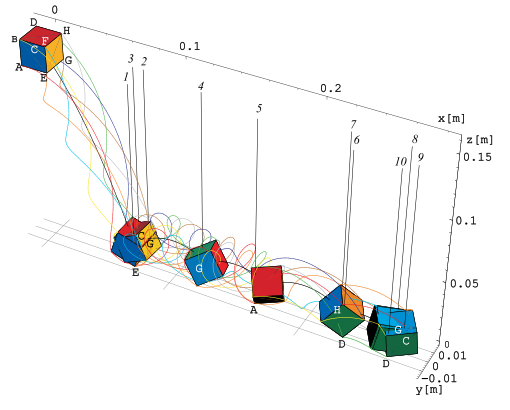

## Ideation

**One sided weighted cube**

This design takes inspiration from the loaded dice, having a weight towards the bottom which encourages the cube to land on one side, preventing it from rolling far. The metal should be something with a heavier weight, like steel or tungsten. 

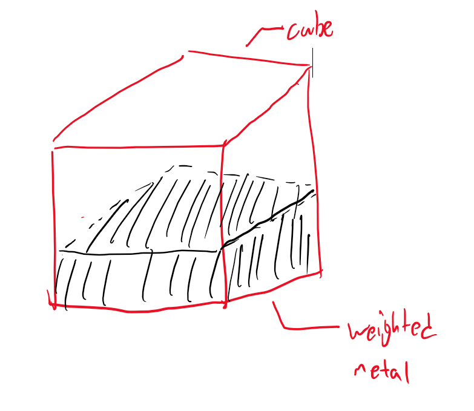

Pros:

- Proven that it works (41% chance of staying on one side)
- Metal is easy to find

Cons:

- Metal can't be too large, because our cube is very small. If metal is too large, the walls are too thin, and the cube will break over time. 
- Although the cube is more inclined to stay on one side, this design isn't the most optimal, as the purpose of a cheating dice is that it's not extremely obvious, meaning there is still room to improve

**Roly-Poly Cube with Weighted Sphere**

Following the roly-poly doll design, this design will prevent the ball from rolling. The ball is heavily weighted, with a large cavity, so no matter which side the ball lands on, the roly-poly effect will work. 

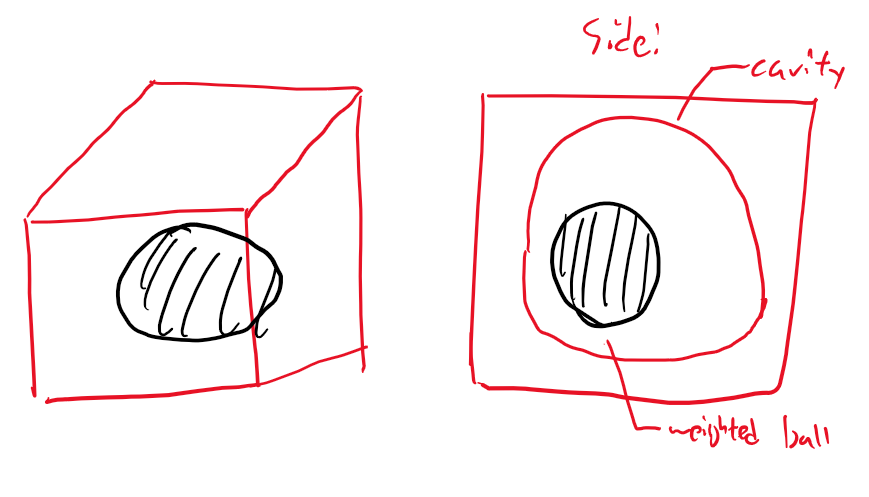

Pros:

- Roly-poly dolls are designed to stay on one side, meaning this design will be very effective
- Metal ball can get very heavy, helping further

Cons:

- Walls would be very thin, if ball is large
- Ball is difficult to insert while 3d printing, leading to sub-optimal cavity design

**Roly-Poly Cube with Metal Pellets**

This design follows a similar idea as the roly-poly weighted ball, but uses heavy metal pellets instead. These pellets equate to a similar weight, and are much smaller than the cube. There is a large cavity, allowing the pellets to fit in the space. 

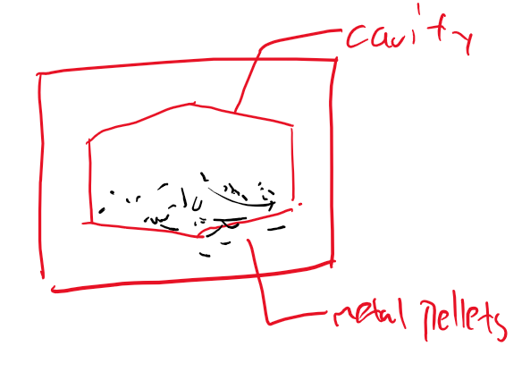

Pros:

- Pellets are easy to insert into design while 3d printing
- Cavity can be smaller, but still achieve the same effect

Cons:

- Pellets cannot be magnetic, because if they are, printing has to be careful so that the pellets don't stick to the nozzle
- Pellets are hard to find :(

**Silicon Cube**

Silicon is a viscoelastic material, so making a whole cube out of silicon would allow for the impacts to be dampened, preventing them from rolling extremely far. 

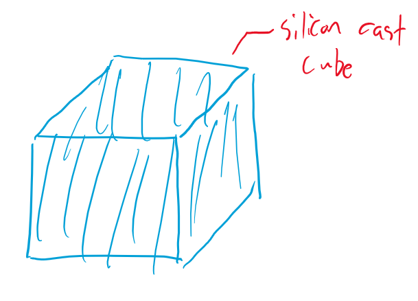

Pros:

- Simple to make, only need to cast silicon
- Doesn't roll far because of material properties

Cons:

- Depending on the friction properties of the type of silicon cast, the cube may have too much grip, and the dropper won't be able to move it

**Final Chosen Idea**

The final chosen idea is the roly-poly design, with metal pellets. The main reason for this design being chosen over the others is because

1. Roly-poly is a proven toy technology (I will test this more later)
2. Pellets are easier to work with, because I can design the packaging for the printing of the object in a simpler way
3. Pellets allow ANY SIDE to be weighted better than the other sides, compared to the one side weight of the cube. 

## Prototypes, Testing & Critique

I prototyped the roly-poly idea with carboard cube, which allowed for a hollow center. I then placed little bolts to simulate the pellets that would be placed inside, then sealed the cube with hot glue.

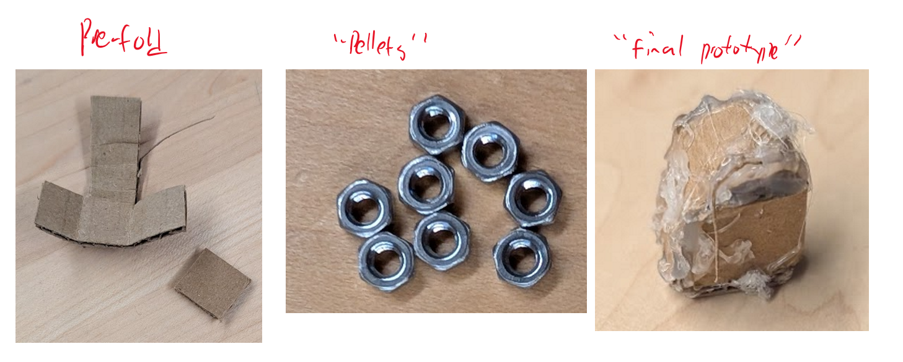

This simulated the roly-poly physics, which allowed me to see if the weighted distribution actually affected how much the cube rolled.

**Results**:

What worked:

- When dropped from a height of ~3 cm, the cube didn't roll very far, which would keep it within the scoring zone

- The sealing method worked well, because I was able to have the walls of the cubes created, making a housing for the pellets, before sealing the top.
- This prototype was very quick to design.

What failed:

- Because of the uneveness of my cutting, the cube wasn't very even, with some sides having an acute angle (instead of 90 degrees). This caused the weight over the unbalanced area to allow for the cube to tilt over, rolling more than intended. 
- The nuts have a lot of space inside, due to their holes. This resulted in a lighter weight, which didn't create the best-case-scenario for anti-roll. Since the COG was made higher, the cube would be less stable.
- Being made from cardboard, the cube itself was also light, which decreased the ability of gravity to prevent it from rolling. 

**Next Steps**:

1. *Use smaller and heavier weights:* By using smaller and heavier weights, I am optimizing the space in the roly-poly design, lowering the COG, and helping it roll less. A very good material choice for this is tungsten, because it is extremely dense. ($19.3g/cm^3$).

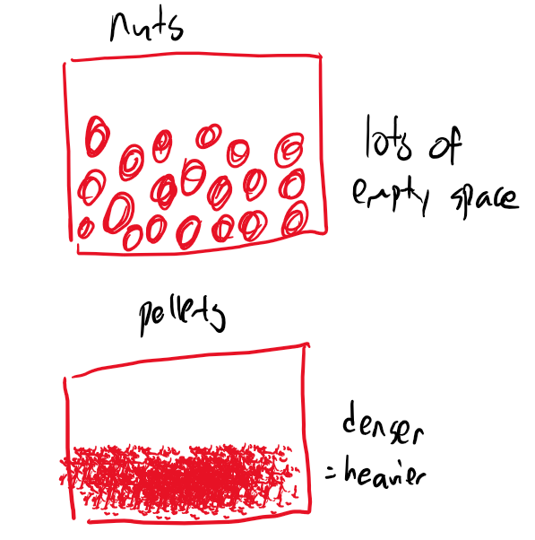

2. *Create a uniform cube:* Make sure that the cube is a uniform cube, so that it doesn't have a tendency to do an extra roll. This can be achieved by 3d printing the cubes. 

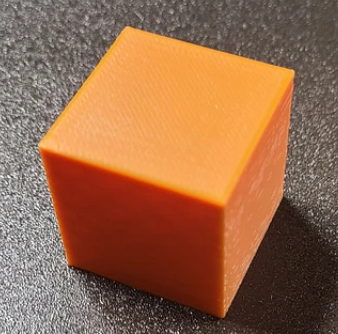

3. *Increase the size of the cavity:* By increasing the size of the cavity, I can fit more cubes in, further improving the effectiveness of my roly-poly design, by lowering the COG even further. I can do this using 3d-printed walls because of their super thin structure. (0.4mm per layer. )

## Final Design

The final concept is extremely compact, and space efficient. Key aspects to note about this design are:

- 19mm x 19mm hole for 10mm x 10mm cubes to fall through
  - Allows a larger space for cubes to rotate around, to prevent any jamming
- Two chutes
  - **Allows for indexing of which side to drop out, to prevent full robot rotations, saving time.** 

- 1mm clearance between dropper and ground
  - Prevents craping on any countersunk screws, and gives tolerance to work with
- 8mm x 4mm triangular spikes
  - Allow for an extremely large contact surface with the dropper
  - Creates the stability needed to prevent lateral movement
- Stepper motor mounted on the bottom, with press fit shaft
  - **Mounting the stepper motor on the bottom saved lots of space, allowing for a completely empty 2nd layer to place wiring and other components**
  - Press fit is the simplest method to connect these surfaces, saving the space that a motor mount would've taken
- Steep chute angle to align with wheel position
  - **Allows the cubes to be dropped outside where the wheels are positioned, staying in the 15cm circle that rescue packets need to be in**

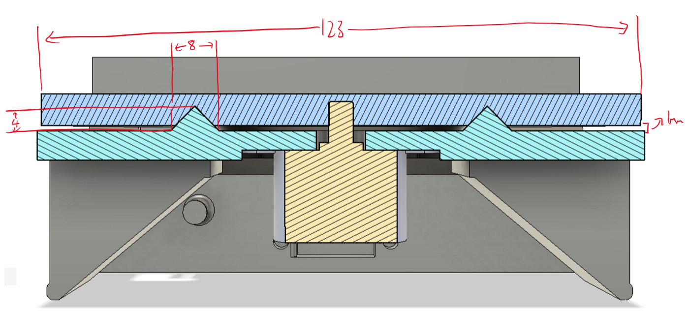

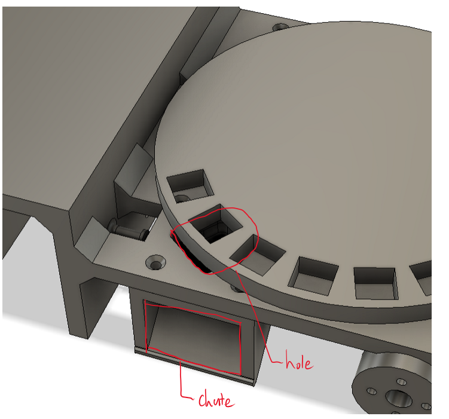

# Conclusion

This design is very effective, and built on our past experiences from other dropper style designs. It fits in an extremely compact format between two layers, allowing for full development on the second layer. However, due to rule changes, the maximum amount of cubes has been changed to 8. This gives access to a wide variety of previously unusable designs. In future sprints, I will investigate different mechanisms to see if there is any more efficient way of packaging the dropper. 